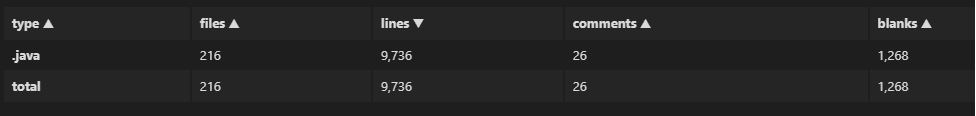

# Readme

This is a compiler to translate SysY language (a subset of C) into MIPS assembly language, with peephole, variable propagation, and public variable merging optimizations.

## code statistics

